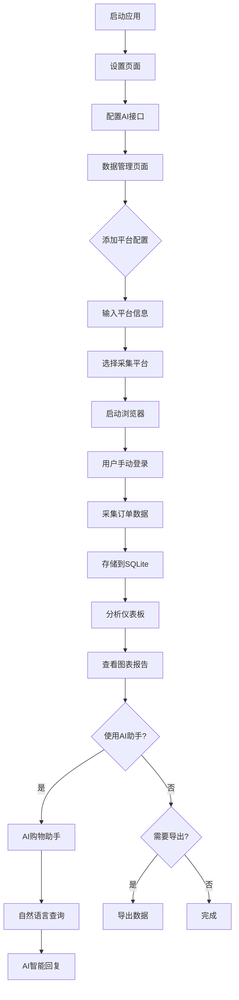

## 1. Product Overview
WhatIBuy是一款个人购物历史分析工具，帮助用户自动整理和分析在多个电商平台的购物数据。通过本地浏览器自动化技术采集订单信息，提供消费趋势分析和可视化报告。

解决用户手动整理购物记录的痛点，提供跨平台消费数据洞察，适用于希望了解个人消费习惯和财务状况的用户。

## 2. Core Features

### 2.1 User Roles
| Role | Registration Method | Core Permissions |
|------|---------------------|------------------|
| Personal User | 本地安装使用 | 数据采集、分析报告查看、数据导出 |

### 2.2 Feature Module
WhatIBuy应用包含以下核心功能模块：
1. **数据管理页面**：平台配置管理、数据采集触发、数据清洗和存储。
2. **分析仪表板**：消费总览、趋势图表、分类分析、平台对比、AI购物助手。
3. **设置页面**：数据源配置、AI接口配置、分析参数设置、数据导出选项。
4. **AI购物助手页面**：智能对话界面，支持自然语言查询购物历史。

### 2.3 Page Details
| Page Name | Module Name | Feature description |
|-----------|-------------|---------------------|
| 数据管理页面 | 平台配置模块 | 添加/编辑电商平台配置，输入平台名称、登录页URL、订单历史URL。支持淘宝、京东、闲鱼平台配置，拼多多暂不支持Web端采集 |
| 数据管理页面 | 平台选择模块 | 选择已配置的电商平台进行数据采集 |
| 数据管理页面 | 采集控制模块 | 启动浏览器自动化，等待用户手动登录，采集订单数据 |
| 数据管理页面 | 数据预览模块 | 显示采集到的原始数据，支持编辑和删除 |
| 分析仪表板 | 消费总览模块 | 显示总消费金额、订单数量、平均单价等关键指标 |
| 分析仪表板 | 趋势分析模块 | 按月份展示消费趋势折线图，支持时间范围筛选 |
| 分析仪表板 | 分类分析模块 | 饼图展示各类别商品消费占比，柱状图显示TOP消费类别 |
| 分析仪表板 | 平台对比模块 | 对比不同平台的消费金额和订单数量 |
| 分析仪表板 | 高价商品模块 | 展示单笔消费最高的商品列表 |
| 分析仪表板 | AI购物助手入口 | 快速跳转到AI对话界面，支持智能查询 |
| AI购物助手页面 | 对话界面模块 | 自然语言输入，智能回复购物相关问题 |
| AI购物助手页面 | 历史对话模块 | 保存对话历史，支持查看过往问答记录 |
| 设置页面 | 数据源配置 | 配置各平台的采集参数和登录状态 |
| 设置页面 | AI接口配置 | 配置AI服务提供商、API密钥、模型名称等参数 |
| 设置页面 | 分析参数设置 | 设置分析的时间范围、分类规则等参数 |
| 设置页面 | 数据导出功能 | 导出分析结果为CSV或PDF格式 |

## 3. Core Process
用户操作流程：
1. 用户首次使用时，在设置页面配置AI接口参数（API密钥、模型等）
2. 在数据管理页面添加电商平台配置，输入平台名称、登录页URL、订单历史URL
   - 淘宝：登录URL https://www.taobao.com/，订单URL https://buyertrade.taobao.com/trade/itemlist/list_bought_items.htm
   - 京东：登录URL https://www.jd.com/，订单URL https://order.jd.com/center/list.action
   - 闲鱼：登录URL https://www.goofish.com/，订单URL https://www.goofish.com/bought
   - 拼多多：暂不支持Web端采集，需要替代方案
3. 选择要采集的已配置电商平台，点击"开始采集"按钮
4. 系统自动启动本地浏览器，导航至平台登录页面基础URL（注意：登录URL可能包含动态参数，用户需手动处理登录流程或粘贴有效的登录URL）
5. 登录成功后，用户点击"登录完成"按钮通知系统
6. 系统自动采集订单数据并存储到本地SQLite数据库
7. 用户可在分析仪表板查看消费分析图表和报告
8. 用户可进入AI购物助手页面，通过自然语言对话查询购物历史
9. AI系统结合本地数据库和配置的大模型，生成智能回答和消费建议
10. 用户可在设置页面管理配置或导出数据

## 4. User Interface Design

### 4.1 Design Style
- **主色调**：蓝色系（#1890ff）体现专业性和可信度
- **辅助色**：浅灰色（#f5f5f5）用于背景和分隔
- **按钮样式**：圆角矩形，主要操作为实心蓝色按钮
- **字体**：系统默认字体，标题16px，正文14px
- **布局风格**：卡片式布局，左右分栏设计
- **图标风格**：简洁的线性图标，使用emoji增强可读性

### 4.2 Page Design Overview
| Page Name | Module Name | UI Elements |
|-----------|-------------|-------------|
| 数据管理页面 | 平台选择模块 | 四平台logo卡片，支持多选，选中状态高亮显示 |
| 数据管理页面 | 采集控制模块 | 大型"开始采集"按钮，显示采集进度条 |
| 数据管理页面 | 数据预览模块 | 表格形式展示订单数据，支持排序和筛选 |
| 分析仪表板 | 消费总览模块 | 大号数字卡片显示关键指标，使用图标增强视觉效果 |
| 分析仪表板 | 趋势分析模块 | 折线图展示消费趋势，支持时间范围选择器 |
| 分析仪表板 | 分类分析模块 | 饼图和柱状图组合，使用不同颜色区分类别 |
| 分析仪表板 | 平台对比模块 | 横向柱状图对比各平台数据，使用平台品牌色 |
| 分析仪表板 | AI购物助手入口 | 醒目的AI助手按钮，跳转到智能对话界面 |
| AI购物助手页面 | 对话界面模块 | 类似聊天应用的界面，支持自然语言输入 |
| AI购物助手页面 | 历史对话模块 | 侧边栏显示历史对话记录，支持搜索 |
| 设置页面 | 数据源配置 | 表单式配置界面，包含开关和输入框 |
| 设置页面 | AI接口配置 | API服务商选择、密钥输入、模型配置表单 |
| 设置页面 | 数据导出功能 | 下拉选择导出格式，导出按钮带进度提示 |

### 4.3 Responsiveness
采用桌面端优先设计，主窗口大小为1200x800px。界面元素支持响应式调整，确保在不同屏幕尺寸下都能正常显示。考虑到数据图表的复杂性，主要面向桌面端用户使用。

### 4.4 AI购物助手界面规范
- **界面布局**：左侧对话历史，右侧主要对话区域
- **输入方式**：底部输入框，支持多行文本输入
- **回复展示**：AI回复使用卡片式设计，区分用户和AI消息
- **加载状态**：AI思考时显示加载动画和提示文字
- **快捷操作**：提供常用问题快捷按钮，如"本月消费"、"年度总结"等

### 4.5 数据可视化规范
- **图表类型**：折线图用于趋势分析，饼图用于占比分析，柱状图用于对比分析
- **颜色方案**：使用温和的颜色搭配，避免过于鲜艳的色彩
- **交互设计**：图表支持悬停显示详细数据，支持缩放和拖拽
- **数据标签**：关键数据点显示具体数值，避免信息过载

## 5. 平台配置详情

### 5.1 支持平台
| 平台名称 | 登录URL | 订单URL | 支持状态 | 备注 |
|---------|---------|---------|----------|------|
| 淘宝 | https://www.taobao.com/ | https://buyertrade.taobao.com/trade/itemlist/list_bought_items.htm | ✅ 支持 | 登录URL含动态参数 |
| 京东 | https://www.jd.com/ | https://order.jd.com/center/list.action | ✅ 支持 | 标准登录流程 |
| 闲鱼 | https://www.goofish.com/ | https://www.goofish.com/bought | ✅ 支持 | 登录URL含动态参数 |
| 拼多多 | - | - | ❌ 不支持 | 无Web端入口，需替代方案 |

### 5.2 动态参数处理
- **淘宝**：登录URL可能包含spm等跟踪参数，系统应导航至基础URL https://www.taobao.com/
- **闲鱼**：登录URL可能包含spm参数，系统应导航至基础URL https://www.goofish.com/
- **用户选项**：提供手动输入有效登录URL的功能，当基础URL失效时允许用户粘贴当前有效的登录链接
- **错误处理**：当检测到登录失败时，提示用户检查URL有效性或手动登录

### 5.3 数据采集限制
- **Web端限制**：仅支持具有完整Web端功能的平台
- **登录验证**：需要用户手动完成登录流程，系统不存储用户凭证
- **数据范围**：仅采集用户可见的订单历史数据
- **频率控制**：建议合理的采集间隔，避免对平台造成过大负担
- **图表类型**：折线图用于趋势分析，饼图用于占比分析，柱状图用于对比分析
- **颜色方案**：使用温和的颜色搭配，避免过于鲜艳的色彩
- **交互设计**：图表支持悬停显示详细数据，支持缩放和拖拽
- **数据标签**：关键数据点显示具体数值，避免信息过载