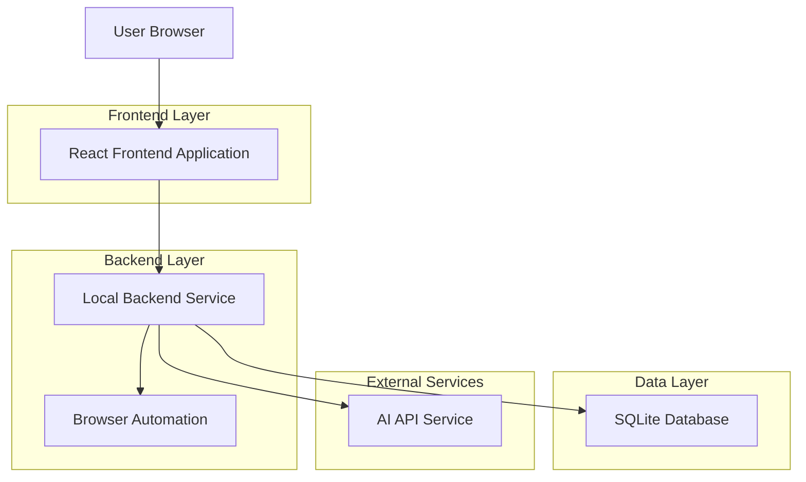
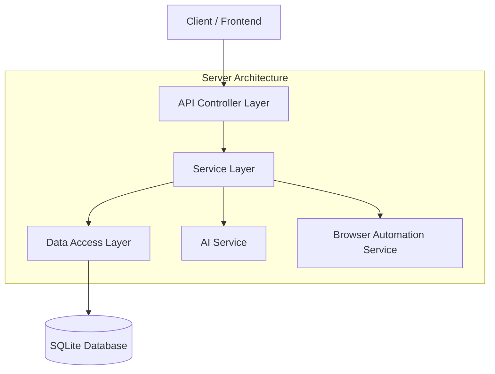
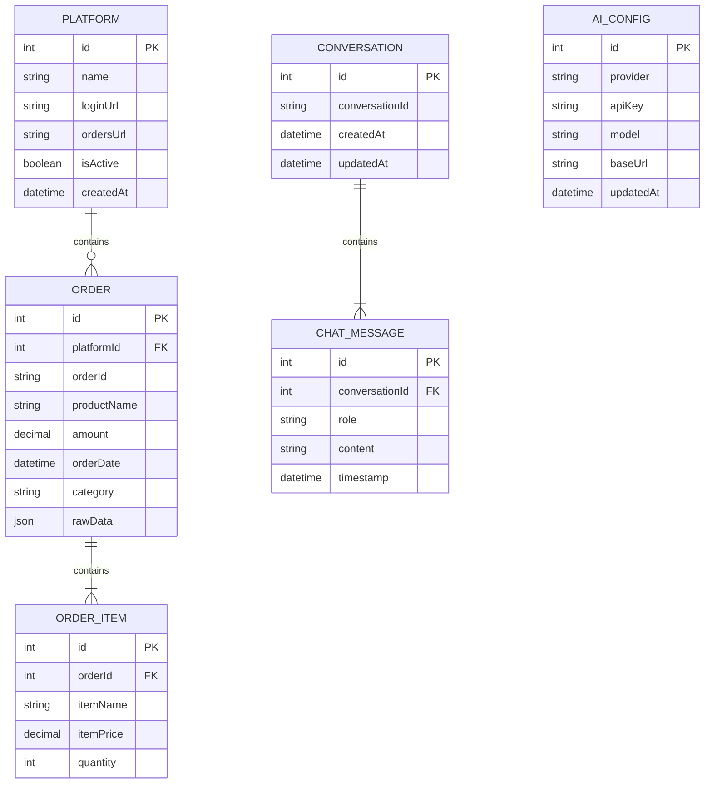

## 1. Architecture design



## 2. Technology Description

- Frontend: React@18 + tailwindcss@3 + vite
- Backend: Node.js@18 + Express@4
- Database: SQLite3
- Browser Automation: Puppeteer
- AI Integration: OpenAI API / Gemini API / Anthropic API
- Initialization Tool: vite-init

## 3. Route definitions

| Route | Purpose |
|-------|---------|
| / | Home page, displays data management and platform configuration |
| /dashboard | Analysis dashboard with charts and AI assistant entry |
| /ai-assistant | AI shopping assistant chat interface |
| /settings | Configuration page for platforms and AI API settings |

## 4. API definitions

### 4.1 Platform Management API

```
GET /api/platforms
```

Response:
| Param Name | Param Type | Description |
|------------|-------------|-------------|
| platforms | array | List of configured platforms |

```
POST /api/platforms
```

Request:
| Param Name | Param Type | isRequired | Description |
|------------|-------------|-------------|-------------|
| name | string | true | Platform name |
| loginUrl | string | true | Login page URL |
| ordersUrl | string | true | Order history URL |

### 4.2 Data Collection API

```
POST /api/collect/:platformId
```

Response:
| Param Name | Param Type | Description |
|------------|-------------|-------------|
| status | string | Collection status |
| message | string | Status message |

### 4.3 AI Assistant API

```
POST /api/ai/chat
```

Request:
| Param Name | Param Type | isRequired | Description |
|------------|-------------|-------------|-------------|
| message | string | true | User's question |
| conversationId | string | false | Conversation ID for context |

Response:
| Param Name | Param Type | Description |
|------------|-------------|-------------|
| reply | string | AI's response |
| conversationId | string | Conversation ID |

### 4.4 AI Configuration API

```
GET /api/ai/config
```

Response:
| Param Name | Param Type | Description |
|------------|-------------|-------------|
| provider | string | AI service provider |
| model | string | Model name |
| baseUrl | string | API base URL |

```
POST /api/ai/config
```

Request:
| Param Name | Param Type | isRequired | Description |
|------------|-------------|-------------|-------------|
| provider | string | true | AI provider (openai/gemini/anthropic) |
| apiKey | string | true | API key |
| model | string | true | Model name |
| baseUrl | string | false | Custom base URL |

## 5. Server architecture diagram



## 6. Data model

### 6.1 Data model definition



### 6.2 Data Definition Language

Platform Table (platforms)
```sql
-- create table
CREATE TABLE platforms (
    id INTEGER PRIMARY KEY AUTOINCREMENT,
    name VARCHAR(100) NOT NULL,
    login_url TEXT NOT NULL,
    orders_url TEXT NOT NULL,
    is_active BOOLEAN DEFAULT 1,
    scraping_rules TEXT,
    created_at DATETIME DEFAULT CURRENT_TIMESTAMP
);

-- create index
CREATE INDEX idx_platforms_active ON platforms(is_active);
```

Order Table (orders)
```sql
-- create table
CREATE TABLE orders (
    id INTEGER PRIMARY KEY AUTOINCREMENT,
    platform_id INTEGER,
    order_id VARCHAR(100) UNIQUE NOT NULL,
    product_name TEXT NOT NULL,
    amount DECIMAL(10,2) NOT NULL,
    order_date DATETIME NOT NULL,
    category VARCHAR(50),
    raw_data TEXT,
    created_at DATETIME DEFAULT CURRENT_TIMESTAMP,
    FOREIGN KEY (platform_id) REFERENCES platforms(id)
);

-- create index
CREATE INDEX idx_orders_date ON orders(order_date);
CREATE INDEX idx_orders_platform ON orders(platform_id);
CREATE INDEX idx_orders_category ON orders(category);
```

AI Configuration Table (ai_config)
```sql
-- create table
CREATE TABLE ai_config (
    id INTEGER PRIMARY KEY AUTOINCREMENT,
    provider VARCHAR(50) NOT NULL,
    api_key TEXT NOT NULL,
    model VARCHAR(100) NOT NULL,
    base_url TEXT,
    updated_at DATETIME DEFAULT CURRENT_TIMESTAMP
);

-- init data
INSERT INTO ai_config (provider, api_key, model) VALUES ('openai', '', 'gpt-3.5-turbo');
```

Conversation Table (conversations)
```sql
-- create table
CREATE TABLE conversations (
    id INTEGER PRIMARY KEY AUTOINCREMENT,
    conversation_id VARCHAR(100) UNIQUE NOT NULL,
    title VARCHAR(200),
    created_at DATETIME DEFAULT CURRENT_TIMESTAMP,
    updated_at DATETIME DEFAULT CURRENT_TIMESTAMP
);

-- create index
CREATE INDEX idx_conversations_id ON conversations(conversation_id);
```

Chat Message Table (chat_messages)
```sql
-- create table
CREATE TABLE chat_messages (
    id INTEGER PRIMARY KEY AUTOINCREMENT,
    conversation_id INTEGER,
    role VARCHAR(20) NOT NULL,
    content TEXT NOT NULL,
    timestamp DATETIME DEFAULT CURRENT_TIMESTAMP,
    FOREIGN KEY (conversation_id) REFERENCES conversations(id)
);

-- create index
CREATE INDEX idx_messages_conversation ON chat_messages(conversation_id);
CREATE INDEX idx_messages_timestamp ON chat_messages(timestamp);
```